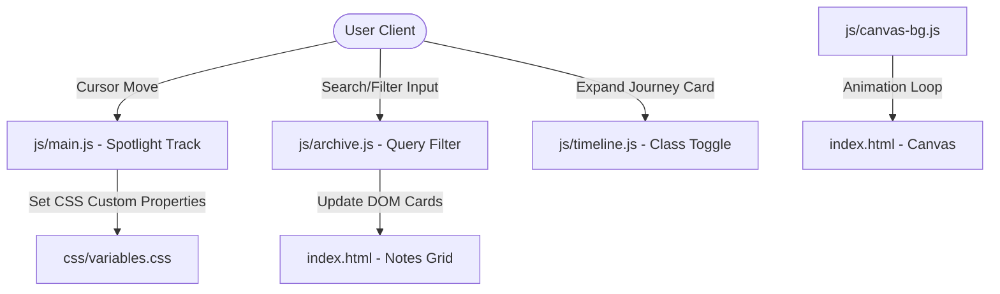

# Swayam Sanchay 🌌

> **Swayam-Sanchay** (स्वयं संचय) — A personal digital identity platform, learning archive, and chronological timeline of backend systems exploration, observability, and operational growth by Utkarsh Dubey.

Designed with rich aesthetics, zero heavy compile/abstraction frameworks, and a performance-first mindset to serve as a clean, transparent log of engineering evolution.

---

## 🎨 Visual Identity & Theme
Swayam Sanchay is built using custom-tailored CSS variables to provide a premium, modern dark-mode aesthetic featuring:
* **Glassmorphic Cards:** High-fidelity layouts utilizing backdrop filtering (`backdrop-filter`) and smooth shadows.
* **Dynamic Spotlight Glows:** Interactivity that tracks cursor coordinates inside containers to draw interactive lighting paths.
* **Canvas Mesh Background:** An interactive particle/mesh field rendering dynamically behind contents.
* **Micro-Animations:** Fluid scroll reveals, pulse states, and hover effects that make the interface feel alive.

---

## 🚀 Key Features

* **Interactive Notebook:** A filterable and searchable catalog of learnings and case studies covering Backend Systems, Infrastructure, Architecture, and Engineering Philosophy.
* **Interactive Timeline:** A chronological sequence of growth milestones featuring expandable diagnostic details.
* **Responsive Layout:** A modular CSS grid and flexbox setup that seamlessly scales across mobile, tablet, and ultra-wide desktop monitors.
* **Terminal System Clock:** A real-time micro-interactive clock component synchronized with the user's browser timezone.
* **Decoupled Architecture:** Engineered using vanilla HTML, vanilla CSS, and vanilla ES6 JavaScript to guarantee optimal page speeds and diagnostic simplicity.

---

## 📁 Repository Structure

```plaintext
portfolio/
├── css/
│   ├── variables.css      # Design tokens (colors, gradients, fonts, animations)
│   ├── global.css         # Reset styles and universal layouts
│   ├── layout.css         # Structuring sections, nav caps, and grids
│   ├── components.css     # Glassmorphic cards, tags, buttons, filters
│   └── animations.css     # Scroll-reveals, glows, and custom pulses
├── js/
│   ├── canvas-bg.js       # Dynamic canvas particle background mesh
│   ├── archive.js         # Notebook databases, search engine, filter tabs
│   ├── timeline.js        # Timeline interactive expansion logs
│   └── main.js            # Intersection observers, spotlight glows, timezone clocks
├── index.html             # Semantic markup, meta-SEO tags, container architecture
├── package.json           # Vite dev-dependency config
└── README.md              # Project documentation
```

---

## 🛠️ Technology Stack

| Technology | Role |
| :--- | :--- |
| **HTML5** | Semantic structure, SEO meta targets, and layouts. |
| **CSS3** | Vanilla variables, Grid/Flexbox layouts, glassmorphism, keyframe animations. |
| **JavaScript (ES6)** | Custom controller modules, search filtering, cursor tracking, DOM observers. |
| **Vite** | Lightweight frontend tooling and hot module reloading server. |

---

## 💻 Local Development

Follow these steps to run the project locally on your system:

### Prerequisites
Make sure you have [Node.js](https://nodejs.org/) installed.

### Installation
1. Clone the repository to your local directory.
2. Open your terminal in the root directory:
   ```bash
   npm install
   ```

### Running the Dev Server
Launch Vite's hot-reload local development server:
```bash
npm run dev
```

The server will spin up, typically running at:
👉 **[http://localhost:5173/](http://localhost:5173/)**

### Building for Production
To bundle and optimize the project assets for production deployment:
```bash
npm run build
```

To preview the production bundle locally:
```bash
npm run preview
```

---

## 🧩 Internal Systems & Interactions



---

## ✍️ Authorship
* **Created & Maintained by:** Utkarsh Dubey
* **Version:** 1.0.0
* **Goal:** Documenting silent systems and operational drift.
